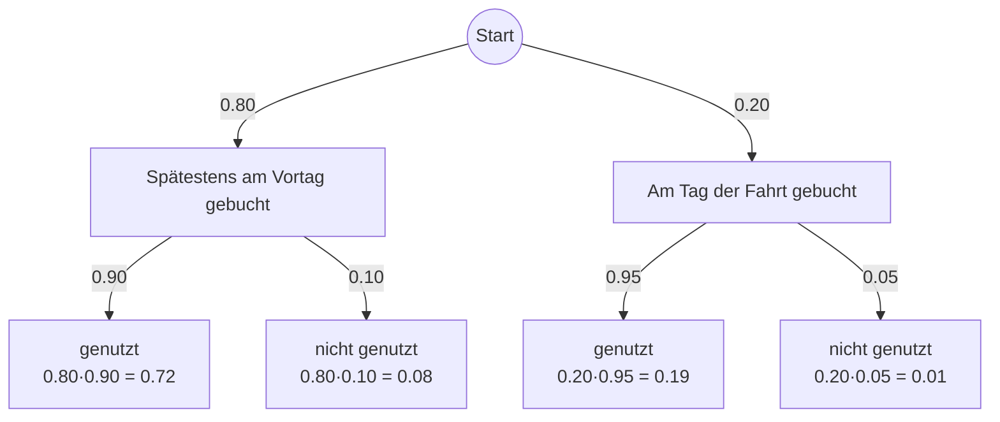

> Unter den Touristen eines Naturparks nutzen erfahrungsgemäß $14$ % das Fahrrad für Ausflüge vor Ort. Im Folgenden werden diese Touristen als Radausflügler bezeichnet. Es soll davon ausgegangen werden, dass in einer zufälligen Auswahl von Touristen des Naturparks die Anzahl der Radausflügler binomialverteilt ist.
>
> Für eine Stichprobe werden $800$ Touristen des Naturparks zufällig ausgewählt.

<Expandable title="A">
  > Bestimmen SIe die Wahrscheinlichkeit dafür, dass sich in der Stichprobe genau $36$ Radausflügler befinden.

  <Steps>
    <Step title="Ansatz">
      [Einzelwahrscheinlichkeit](/binomialverteilung#einzelwahrscheinlichkeit) berechnen.

      **Gegeben**:

      $$
      \begin{alignedat}{1}
n &= 300 \\
p &= 0.14 \\
k &= 36
\end{alignedat}
      $$
    </Step>
    <Step title="Mit CAS berechnen">
      <Tip>
        ### Taschenrechnerbefehl

        1. Menu
        2. Wahrscheinlichkeit (5)
        3. Verteilung (5)
        4. Binomial Pdf (A)
      </Tip>
      

      $binomPdf(300,0.14,36) \approx 0.042$
    </Step>
    <Step title="Antwort">
      > Die Wahrscheinlichkeit dafür, dass sich in der Stichprobe genau $36$ Radausflügler befinden beträgt ungefähr $4,2 \space \%$.
    </Step>
  </Steps>
</Expandable>

<Expandable title="B">
  > Ermitteln Sie die Wahrscheinlichkeit dafür, dass die Anzahl der Radausflügler in der Stichprobe um mindestens $10$ % größer ist als der Erwartungswert für diese Anzahl.

  <Steps>
    <Step title="Erwartungswert berechnen">
      Berechne den [Erwartungswert](/binomialverteilung#erwartungswert) mit den gegeben Werten:

      $E(X)= n \cdot p = 300 \cdot 0,14 = 42$
    </Step>
    <Step title="Schwellwert berechnen">
      Da wir mindestens $10 \space \%$ mehr über dem zu erwartenden Wert liegen wollen, berechnen wir:

      $$
      1.10 \cdot 42 = 46.2 
      $$
    </Step>
    <Step title="Schwellwert aufrunden ">
      Da $X$ lediglich ganzzahlig sein kann, gilt $46.2 \Rightarrow 47$ (Es gibt keine halben Personen).
    </Step>
    <Step title="Kumulierte Wahrscheinlichkeit berechnen ">
      Nun müssen wir die [kumulierte Wahrscheinlichkeit](/binomialverteilung#kumulierte-wahrscheinlichkeit) berechnen.

      **Gegeben**:

      $$
      \begin{alignedat}{1}
n &= 300 \\
p &= 0.14 \\
n &\geq k \geq 47

\end{alignedat}
      $$

      **In Formel einsetzen**

      $$
      P(X \leq 47) = \sum ^ {300} _ {i = 47} \binom {300}{i} \cdot 0.14 ^i \cdot (1-0.14) ^{300 - i}
      $$

      <Tip>
        ### Taschenrechnerbefehl

        1. Menu
        2. Wahrscheinlichkeit (5)
        3. Verteilung (5)
        4. Binomial Cdf (B)
      </Tip>
      

      $binomCdf(300,0.14,47,300) \approx 0,2243$

      > Die Wahrscheinlichkeit dafür, dass die Anzahl der Radausflügler in der Stichprobe um mindestens $10 \space \%$ größer als der Erwartungswert für diese Anzahl ist, beträgt ungefähr $22.43 \space \%$.
    </Step>
  </Steps>
</Expandable>

> Um den Naturpark als Reiseziel attraktiver zu machen, setzt der dortige Tourismusverband Shuttelbusse ein. Die Fahrkarten dür diese Busse können ausschließlich online gebucht werden und sind jeweils für einen bestimmten Tag gültig. Erfahrungsgemäß werden $80$ % aller gebuchter Fahrkarten spätestens am Vortag der Fahrt gebucht. Von diesen spätestens am Vortag gebuchten Fahrkarten werden $90$ % auch täglich genutzt. Bei den restlichen, erst am Tag der Fahrt gebuchten Fahrkarten liegt der Anteil mit $95$ % etwas höher

<Expandable title="C">
  > Stellen Sie den Sachverhalt in einem beschrifteten Baumdiagramm dar.

  ```mermaid
  graph TD

    Start((Start))

    Start -->|0.80| BV[Spätestens am Vortag gebucht]
    Start -->|0.20| BT[Am Tag der Fahrt gebucht]

    BV -->|0.90| BV_G[genutzt<br>0.80·0.90 = 0.72]
    BV -->|0.10| BV_N[nicht genutzt<br>0.80·0.10 = 0.08]

    BT -->|0.95| BT_G[genutzt<br>0.20·0.95 = 0.19]
    BT -->|0.05| BT_N[nicht genutzt<br>0.20·0.05 = 0.01]
```
</Expandable>

<Expandable title="Content">
  > Betrachtet wird eine zufällig ausgewählte, nicht genutzte Fahrkarte. Beurteilen Sie die folgende Aussage:
  >
  > _„Die Wahrscheinlichkeit dafür, dass diese Fahrkarte spätestens am Vortrag gebucht wurde, ist achtmal so groß wie die Wahrscheinlichkeit dafür, dass sie erst am Tag der Fahrt gebucht wurde.“_


</Expandable>